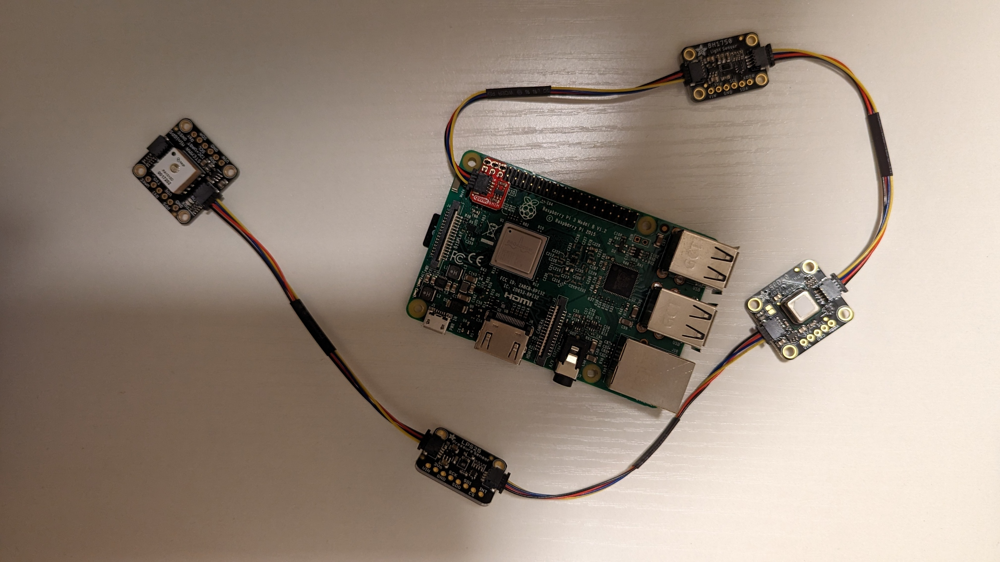

# Rocket Sensors

## Installation
### There are Two Versions of the Software, the GPS branch with GPS functionality and the main branch without.
If the GPS branch doesn't work, roll back to the previous commit to the **GPS WORKING** version.
Install circuit python from [here](https://learn.adafruit.com/circuitpython-on-raspberrypi-linux/installing-circuitpython-on-raspberry-pi)
```
pip install -r requirements.txt
```
You may need to enable I2C
```
sudo raspi-config
Interface Options -> I2C
```

## Usage
**(THE BETTER ONE)** If you want the script that updates once every user defined seconds
```
python3 async_update.py
```

If you want the script that updates once every about 5 seconds use this:
```
python3 slow_update.py
```

## Demo
<div align="center">
  
</div>
