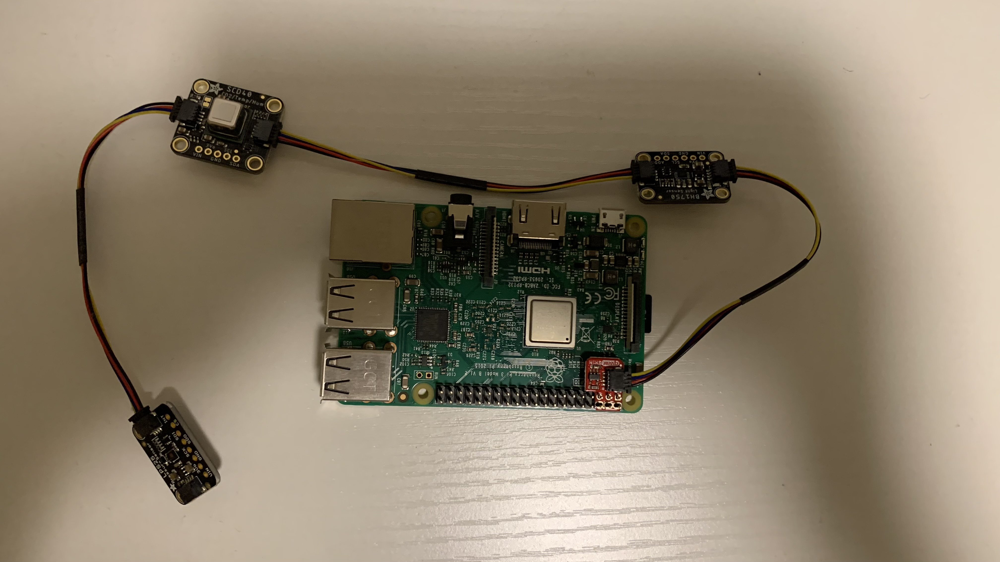

# Rocket Sensors

## Installation
Install circuit python from [here](https://learn.adafruit.com/circuitpython-on-raspberrypi-linux/installing-circuitpython-on-raspberry-pi)
```
pip install -r requirements.txt
```
<br>

## Usage
```
python3 main.py
```
<br>

## Demo
<div align="center">
  
</div>